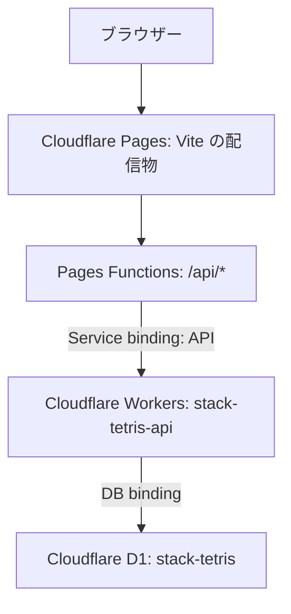

# Cloudflare のアカウント・40LINE記録

公開URL: **[https://stack-tetris.pages.dev/](https://stack-tetris.pages.dev/)**

2026-09-07にPages・API Worker・D1を作成し、公開先でゲスト作成、登録、40LINE記録保存、別ブラウザーからのログインと自己ベスト復元、ログアウトを確認しました。現在の設定ファイルはこの公開先を参照します。別アカウントへ公開する場合は以下の初回公開手順で新しいDB IDを設定してください。

## 構成



Pages FunctionsはAPI Workerへの転送だけを行います。ブラウザーは同じオリジンの`/api/v1/*`を呼び、Cookieを送ります。API Workerは`workers.dev`とプレビューURLを無効化し、PagesのService binding経由で使います。P2P対戦は引き続きブラウザー間で処理します。[Cloudflare: Service bindings](https://developers.cloudflare.com/pages/functions/bindings/#service-bindings)

## 動作

- URLへのアクセスでゲストセッションを作成。Cookieが有効な間は同じゲストとして復帰します。
- 「ログイン」内でメールアドレス・パスワードによるログインまたは新規登録。パスワードは12〜128文字です。
- ゲストから新規登録すると自己ベストを引き継ぎ、セッションを交換します。既存アカウントへのログインは、そのアカウントの自己ベストを読み込みます。
- 40LINE画面に自己ベストを表示。クリア時のリプレイをAPIで再生・検証し、より速い場合だけD1を更新します。カウントダウン・一時停止は計測に含めません。
- ゲームオーバー・途中リセット・リプレイ再生では保存しません。ゲーム開始時のユーザーと保存時のセッションが異なる場合も保存しません。
- 通信エラー時は未保存であることと再保存ボタンを表示。未送信記録はそのタブのメモリーに保持し、ページを閉じると失われます。リプレイは通常どおり手動保存できます。
- ログアウトすると新しいゲストへ切り替わります。会員の記録はD1に残ります。
- セッションの期限は30日。期限切れセッション・レート制限・30日以上経過してセッションのないゲストを毎時削除します。会員は自動削除しません。

## ローカル実行

```bash
npm ci
npm run db:local
npm run dev:api
```

別ターミナルで`npm run dev`を起動し、`http://localhost:5173`を開きます。Viteが`/api`をローカルWorkerへ転送します。DBは`apps/api/.wrangler/`に保存され、リポジトリには含めません。

Pages FunctionsとService bindingも含めて確認する場合は、APIを起動したまま次を実行し、`http://localhost:8788`を開きます。

```bash
npm run build
npm run dev:cloudflare
```

`npm run check`は型チェック、ゲームのユニットテスト、実際のworkerd/D1エミュレーターによるAPIテスト、ブラウザー用ビルドを行います。`npm run test:e2e`はローカルWorker・D1・PeerServer・Viteを起動してブラウザー操作を検証します。ブラウザーテスト用UIはポート5179、APIはポート8797・一時DBを使い、通常の開発用DBとレート制限から隔離します。テスト用メール・パスワードは架空の値です。

## 初回公開

Cloudflareの認証とアカウントへのアクセスが必要です。トークンをソースコードや`VITE_*`へ記載しないでください。

```bash
npx wrangler login
npx wrangler d1 create stack-tetris
```

表示された実際のDB IDを使います（`00000000-...`はローカル開発用の仮値です）。Pages名が既に使われている場合は、独自の名前へ変更できます。

```bash
CLOUDFLARE_D1_DATABASE_ID=実際のDB-ID \
CLOUDFLARE_PAGES_PROJECT=自分のPagesプロジェクト名 \
node scripts/configure-cloudflare.mjs
npx wrangler pages project create 自分のPagesプロジェクト名 --production-branch main
npm run check
npx wrangler d1 migrations apply DB --remote --config apps/api/wrangler.jsonc
npm run deploy:api
npm run deploy:pages -- --branch main
```

公開はAPI Worker→Pagesの順です。PagesとWorkerは同じCloudflareアカウントに作成します。PagesのGit連携で自動ビルドする場合も、APIのデプロイとD1マイグレーションを別途実行する必要があります。

Cloudflareを初めて使うアカウントでは、Cron登録時にエラー`10063`になる場合があります。その場合はダッシュボードのWorkers画面で`workers.dev`サブドメインを作成してから再実行します。今回のアカウントでは`ikkungames110.workers.dev`を作成済みです。API自体の`workers.dev`公開は無効のままです。

パスワード処理とリプレイ検証はCPUを使います。Workers FreeのCPU上限は1リクエスト10msで、ローカル開発ではこの上限を再現しません。公開先のプランと実測を確認してください。実装・デプロイ手順は有料プランへの契約変更を行いません。[Cloudflare: CPU制限](https://developers.cloudflare.com/workers/platform/limits/#cpu-time)

## push時の自動公開

現在、公開先変数と`CLOUDFLARE_ACCOUNT_ID`は設定済みです。`CLOUDFLARE_API_TOKEN`の登録と`CLOUDFLARE_ENABLED=true`の設定が済むまでは、Cloudflareワークフローをスキップします。ローカルの`wrangler login`はGitHub Actionsの認証には引き継がれません。

GitHubのSettings → Secrets and variables → Actionsに設定します。

| 種類     | 名前                        | 内容                                                                      |
| -------- | --------------------------- | ------------------------------------------------------------------------- |
| Secret   | `CLOUDFLARE_API_TOKEN`      | 対象アカウントのWorkers Scripts・Cloudflare Pages・D1を編集できるトークン |
| Secret   | `CLOUDFLARE_ACCOUNT_ID`     | 対象のCloudflareアカウントID                                              |
| Variable | `CLOUDFLARE_D1_DATABASE_ID` | 作成済みD1のID                                                            |
| Variable | `CLOUDFLARE_PAGES_PROJECT`  | 作成済みPages名。省略時`stack-tetris`                                     |
| Variable | `CLOUDFLARE_WORKER_NAME`    | 任意。省略時`stack-tetris-api`                                            |
| Variable | `CLOUDFLARE_ENABLED`        | 初期リソースと上記設定を準備してから`true`                                |

[Cloudflare公開ワークフロー](../.github/workflows/cloudflare.yml)は検証→設定→D1マイグレーション→Worker→Pagesの順です。未設定時はスキップします。GitHub Pages単体にはAPI・D1がないため、既存のPagesワークフローでは`VITE_ACCOUNTS_ENABLED=false`でアカウント画面を非表示にします。アカウント機能はCloudflare側の公開URLで利用します（既定で有効）。

## API v1

認証情報はCookieだけから取得します。更新APIは同じオリジンの`Origin`を必須とし、JSONのみ受け付けます。レスポンスは`Cache-Control: no-store`です。

| メソッド・パス                | 内容                                                                                                               |
| ----------------------------- | ------------------------------------------------------------------------------------------------------------------ |
| `GET /api/v1/health`          | 死活確認                                                                                                           |
| `POST /api/v1/session`        | セッション復帰／ゲスト作成                                                                                         |
| `GET /api/v1/me`              | 自分のユーザー情報と40LINE自己ベスト                                                                               |
| `POST /api/v1/register`       | `{email, password}`でゲストを会員へ移行                                                                            |
| `POST /api/v1/login`          | `{email, password}`でログイン                                                                                      |
| `POST /api/v1/logout`         | 現在のセッションを破棄し新しいゲストを作成                                                                         |
| `POST /api/v1/records/40line` | `{userId, replay}`を検証し自己ベストを更新。`userId`は所有者の指定ではなく、プレイ中のユーザー変更を検出する照合値 |

セッション・ログイン・記録APIの成功時は`{user: {id, kind, email}, best40: {ticks, achievedAt} | null}`。時刻はUNIXミリ秒、タイムは60Hzの整数tickです。エラーは`{error: string}`とHTTPステータス（400/401/403/409/413/415/429/500）を返します。

## DB拡張と実装上の境界

`users`、`sessions`、`personal_bests`、`rate_limits`を分けています。追加項目は`apps/api/migrations/0002_*.sql`以降のマイグレーションで追加し、既存の適用済みSQLを編集しません。新しい記録モードを加える場合は`personal_bests.mode`の制約も更新してください。

パスワードはソルト付きscrypt（N=16384/r=8/p=5）、セッションはランダム32バイトのトークンを使いDBにはSHA-256値だけを保存します。CookieはHttpOnly・SameSite=Strictで、本番HTTPSではSecure＋`__Host-`接頭辞を付けます。ログイン試行はIPとメールアドレスのハッシュ単位で制限します。SQLにはバインドパラメーターを使用します。[OWASP: Password Storage](https://cheatsheetseries.owasp.org/cheatsheets/Password_Storage_Cheat_Sheet.html#scrypt)

現段階ではメール所有確認・パスワード再設定・アカウント削除の画面・ランキングはありません。メール送信サービスも使用していません。記録検証は通常ルールでの完走を確認するもので、自動操作や人間が実際にかけた時間の証明ではありません。
