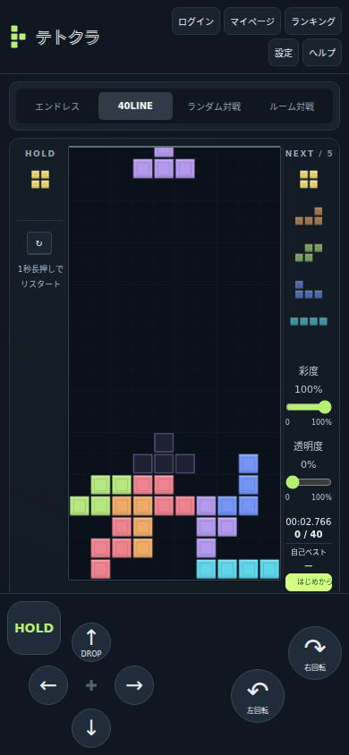
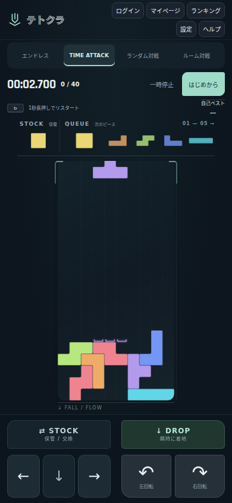

# FALL / FLOW — テトクラのビジュアル設計

## コンセプト

落下する軌道と着地の光を、ロゴ・盤面・操作UIで共通のモチーフにする。
青緑を含むダーク背景と低彩度のミント色をUIに使い、7種類のピースの色を主役にする。
特定の既存製品の画面やロゴは参照・流用していない。

## 維持する仕様

- I＝水色、O＝黄色、T＝紫、S＝緑、Z＝赤、J＝青、L＝オレンジ。
- 移動、左右回転、ソフト／ハードドロップ、ホールド、5個の予告。
- エンジン・入力処理・リプレイ形式・対戦プロトコルは変更しない。
- 盤面は10×20行と出現位置の上側0.5行を維持。20行の前提がコア・出現処理・リプレイ・テンプレート検証にまたがるため、22行化は今回行わない。
- 保存済みの素材設定ID・彩度・透明度は引き継ぐ。

## 表現

### ピース

`piece-surface.ts`が占有セルの共有辺を取り除き、外周を角丸パスとして描く。
サテン・クリスタル・メタル・ルミナス・ファイバー・ストライプの各素材も、連結形状全体に適用する。
セルごとの四角い内枠は描かない。固定済みの盤面は既存の色データから再構成するため、接する同色セルは一つの面につながる。元のピースIDはゲーム状態へ追加しない。

### 着地点

既存の`landing()`の結果から、列ごとの最下辺に短いU字の光のレールを描く。
投影されたピースの塗りや完全な外周は描かない。段差のある着地はレールの高さで伝える。
着地レールは素材やピース透明度に左右されず読み取れる。

### HUD・操作

- STOCK（保管）とQUEUE（次のピース）を盤面上に置く。
- QUEUEは横方向に5個。左端を大きくし、後続も形状判別に十分な明るさを保つ。
- モード名称はTIME ATTACK。40ライン消去の競技内容と記録は維持する。
- 底部の操作は、左の「保管・左右移動・ソフトドロップ」と右の「ハードドロップ・左右回転」に分割。
- タップ領域は最小44×44 CSS px。移動の長押し・複数指・キャンセル処理は従来の入力処理を使う。
- 横向きスマホは左右端に操作を置く。オンライン対戦の相手盤面は自分の盤面横に縮小表示。
- 彩度・透明度はマイページへ移動。競技画面上部に時間・進捗・一時停止を集約。

## 検証

`tests/e2e/design.spec.ts`で上部HUD、最小タップ領域、画面内の配置、7種×4回転×空／段差盤面の描画と着地レールを確認する。
既存のレイアウト・タッチ・素材・RENテストは新しい配置に合わせて更新し、入力・永続化・リプレイの検証を維持する。

## 実画面

同じシードとタッチ操作でTIME ATTACKをプレイした、変更前後のブラウザー画面。
画面上の経過時間は撮影タイミングにより異なる。

| 変更前（390×844）                        | 変更後（390×844）                       |
| ---------------------------------------- | --------------------------------------- |
|  |  |

- [小型スマホ・320×568](screenshots/small-mobile.png)
- [横向きスマホ・844×390](screenshots/landscape.png)
- [PC・1440×1000](screenshots/desktop.png)
- [オンライン対戦・390×844](screenshots/online-mobile.png)
- [7種類のピースと色の対応](screenshots/seven-pieces.png)

Chromiumのスマホエミュレーションで撮影・操作確認。実機での親指の届きやすさや、端末ごとの描画性能の評価は別途必要。

### テスト環境の調整

- 音声試験では、非同期に予約されるBGMを回転SEの再生回数に含めないよう修正。
- 手動フレーム試験では、ゲーム描画と画面サイズ計測の複数の`requestAnimationFrame`を同じフレームで処理する。
- 一括実行はローカルAPIのゲスト発行・認証回数制限に達するため、対象ファイルを分割し、各実行で新しいテスト用DBを使って検証する。本番の制限値は変更しない。

### 検証結果

- `npm run check`：型チェック、ユニット254件、API17件、ビルドが成功。
- Playwright：全136ケースを確認。一括実行の失敗・未実行ケースは上記の環境調整後に分割実行し、全ケースの成功を確認。
- 最終レイアウト・完走・リプレイ検証28件が成功。
- 変更ファイルのPrettierチェックと`git diff --check`が成功。
