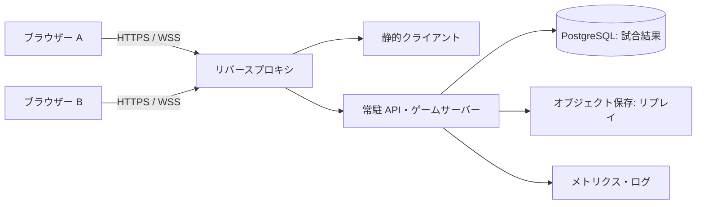

# ネット対戦・インフラ

[設計書一覧](README.md)

本書は本プロジェクトの構成案。PPT2 の通信方式や SEGA のインフラを調べて再現するものではない。

## 現在の実装: GitHub Pages + P2P（2026-09-06）

標準のオンライン対戦はWebRTC DataChannelに変更した。画面は静的ファイルだけで配信し、GitHub Pagesに配置できる。Node.jsゲームサーバーの運用は不要。

- `apps/web/online.ts` がPeerJSを使って接続を作る。6文字のルームコードを仲介IDに対応させる。既定はPeerJS Cloudで接続情報を交換し、ゲームデータはDataChannel経由で送る。
- `packages/network/rooms.ts` にルーム管理・判定を共通化。Node.js専用APIを取り除き、ホストのブラウザーが同じ60Hzのエンジンを実行する。相手に送る盤面は20Hz、固定・攻撃・フェーズ変更時も配信する。
- RTCDataChannelは順序付き・信頼性あり。受信する操作のサイズ／頻度／版／試合ID／連番を検証する。参加者はホストのスナップショットを検証してから表示する。
- ホストはページを開いたままにする。長時間のブラウザー停止は試合終了。ホスト交代・状態の永続化はない。参加者だけは10秒以内の再接続・再読み込み復帰が可能。
- P2Pのホストは判定を書き換えられるため、悪意あるホストに対する公平性は保証しない。友人同士の招待対戦が対象。
- 既定で外部STUNを使う。直接接続できないNAT／ファイアウォールの場合はTURNが必要で、画面から接続情報を指定する。TURN認証情報は保存・招待リンクへの埋め込みをしない。TURNを使う再読み込みでは設定の再入力が必要になる場合がある。
- 自前のゲームサーバーは不要だが、外部の接続仲介・STUN・必要時のTURNへの依存はある。「外部サーバーが一切ない」方式ではない。手動でSDPを交換する方式は未実装。
- `.github/workflows/pages.yml` で型・テスト・ビルドを確認して `dist/` をPagesへ配信する。Viteの `base: './'` でリポジトリ名付きパスにも対応する。

参考: [PeerJSの接続仲介](https://peerjs.com/client/getting-started)、[WebRTCのTURN](https://webrtc.org/getting-started/turn-server)、[GitHub Pagesの静的配信](https://docs.github.com/en/pages/getting-started-with-github-pages/what-is-github-pages)。起動・公開設定は[ルートREADME](../README.md#オンライン対戦p2pゲームサーバー不要)を参照。

## 以前のWebSocket実装（任意のサーバー用、標準画面では不使用）

以下の番号付き各節は将来像を含む設計案。以下はP2Pへ切り替える前に実装した構成。`apps/server` にサーバー用アダプターを残している。

- `apps/server` が共通エンジンを60Hzで進め、両者に20Hzの公開状態を送る。固定・消去・おじゃま・フェーズ変更は直後にも配信。seed、袋の残り、各乱数状態は送らない。
- ブラウザーは確定状態を描画する。現段階では先行表示・ロールバック・補間・予定tick・ACKはないため、操作感は往復遅延の影響を受ける。
- JSONプロトコル版1、ルール版一致を必須とする。`create / join / resume / ready / input / leave / ping` と `joined / room / closed / error / pong` を使用。
- 入力は接続に紐づく席にだけ適用。`matchId / round / seq`、0〜127のビット範囲を検証する。1tickにつきキューから1入力を適用し、キュー上限8件を超えると破棄・中立化する。入力が250ms届かなければ保持状態を中立化。過去ラウンド・別試合・重複seqは無視する。
- 同一ルームは2席。暗号学的乱数の6文字コードで入室し、復帰用の192bitトークンをタブのsessionStorageに保持する。両者準備完了後に開始・次ラウンド・再戦。席が切断中でも第三者の入室で置き換えない。
- 通信断でも試合は進行する。サーバーが切断を検知してから10秒以内なら復帰でき、超過時は棄権。両者切断なら無効。明示退室でルームを閉じ、対戦中は相手の勝ち。通常の試合決着後は勝者を保持する。
- WebSocket pingは3秒間隔。無応答の検知まで最大約6秒かかり、その後に復帰猶予が始まる。クライアントも応答途絶を検知して再接続する。
- Origin検証（既定はHost一致、配信時は許可リストを設定可能）、2KBの受信上限、1接続180メッセージ/秒、送信滞留512KBで切断。最大100ルーム・220接続、待機／結果画面30分で閉鎖。これらは負荷保証値ではない。
- 以前はViteへ同じWebSocketサーバーを追加していたが、現在のdev / previewは静的配信のみ。`npm start` は静的配信と通信を単一ポートで提供し、`/health` で起動を確認できる。HTTPS終端は外部プロキシで行う。WebSocket実装には[ws公式資料](https://github.com/websockets/ws)を参照。
- 状態はプロセスメモリーのみ。サーバー停止で試合無効。オンラインの結果・リプレイの永続保存、アカウント、公開マッチング、負荷試験、インターネット公開は未実施。

起動と遊び方は[ルートREADME](../README.md#オンライン対戦)を参照。

## 1. 実装構成

空のリポジトリから始めるため、まず TypeScript のブラウザークライアントと常駐 Node.js サーバーを提案する。ゲームロジックを共通化し、描画・通信を抜いたエンジン単体で検証できることを優先する。ライブラリとサポート中の実行環境の具体的な版は実装着手時に固定する。

```text
apps/web/          Canvas 2D描画、入力、ルーム画面、音、先行表示と補正
apps/server/       HTTP API、WebSocket、ルーム、試合進行、結果保存
packages/core/     盤面、SRS、HOLD、消去、攻撃、相殺、固定tick更新
packages/protocol/メッセージ型、入力検証、版チェック
packages/rules/    ルール定義と版
tests/fixtures/    実機照合用の盤面・入力・期待値
docs/             本設計書
```

中心 API は `stepMatch(state, inputsForBothPlayers, rules) -> { state, events }`。60 Hz の固定刻みで動作し、DOM、現在時刻、ネットワーク、描画状態に依存させない。乱数は状態として渡し、整数演算・固定小数点を使う。

保持する状態は、両者の盤面、現在ミノ、HOLD、ミノ列消費位置、REN、B2B、回転履歴、DAS/ARR、キー保持状態、接地猶予とリセット数、落下の端数、出現／消去待ち、受信キュー、乱数、ラウンド結果。盤面だけの保存では決定的な再現にならない。

## 2. 同期方式

**サーバーが正しい盤面・攻撃・勝敗を決め、クライアントは操作を先行表示する方式** を採用する。入力だけの完全なロックステップは通信量を抑えられるが、全員の入力が届くまで更新できず、遅延や停止が操作に出る。予測とサーバー状態による補正の考え方を用いる。[Glenn Fiedler: Deterministic Lockstep](https://gafferongames.com/post/deterministic_lockstep/)、[Game Networking](https://gafferongames.com/post/what_every_programmer_needs_to_know_about_game_networking/)

| 方式                         | 特徴                                                   | 初版の判断               |
| ---------------------------- | ------------------------------------------------------ | ------------------------ |
| 入力を待つロックステップ     | 単純な同期・小さい通信量。遅い通信に全体が引っ張られる | ローカルの再現テスト向け |
| 両者を予測するロールバック   | 相手の入力を予測して巻き戻す。対戦判定の訂正が複雑     | 必要になってから検討     |
| サーバー確定＋自分の先行表示 | 即時の操作感と中央での判定。補正用の履歴が必要         | 採用                     |

初版のトランスポートは WSS。TCP の再送待ちで後続メッセージも遅れるため、回線が悪い条件では WebTransport 等を比較する。初版から複数トランスポートは実装しない。

### 入力と時刻

- `tick` は試合中の連続した整数。ラウンド番号も別に送る。
- ping/pong でサーバー tick と RTT を推定する。クライアントの壁時計を勝敗に使用しない。
- 入力に `seq, roundId, targetTick, heldButtons, pressedButtons` を付ける。押しっぱなし状態と一度だけの押下を分離する。
- 初版では推定サーバー現在 tick より3〜8 ticks 先を `targetTick` とする。両者の RTT を測り、余裕 tick 数をラウンド開始時に共通値へ固定する。
- 手元はその先の tick まで予測して即座に動かす。サーバーは指定 tick に入力を適用し、入力待ちで止まらない。
- 締切を過ぎた入力は過去へ適用せず棄却して ACK に記録する。未来すぎる tick、重複 seq、旧ラウンドの入力も拒否する。
- 入力が来ない tick は直前の保持状態を使い、一度だけの押下を繰り返さない。入力状態の定期送信が250 ms途絶えたら保持を中立へ戻す案とする。
- クライアントのフォーカス喪失時は即座に全キー解放を送る。対戦の時間は止めない。

これは初期の同期規約。遠い相手ほど「手元の表示と確定」の差が大きくなるため、補正頻度を計測して余裕 tick 数や対応地域を調整する。サーバー側の過去フレームの巻き戻しは初版に含めない。

### 状態配信・補正

サーバーは10〜20 Hzで状態を送り、固定・攻撃・敗北などの重要イベントは更新直後にも通知する。以下の頻度は性能検証前の初期値。

1. 自分の予測状態、入力履歴、サーバーイベントを約2秒保持する。
2. サーバーの `snapshotTick` に対応する予測状態と、同じ公開状態のハッシュを比較する。
3. 違っていれば、その tick の正しい状態に戻し、その後の受理済み・未確定入力を予定 tick 順に再実行する。棄却済み入力は再実行しない。
4. 攻撃・勝敗はサーバーイベントを正とする。予測した攻撃をサーバーへ「結果」として申告しない。
5. 音や攻撃演出は `eventId` で重複再生を防ぐ。勝敗画面は確定イベント後に表示する。

相手盤面はサーバーから来た確定状態を短いバッファ経由で表示する。必要なら落下中ミノの見た目だけ補間し、固定セルやライン消去を連続補間しない。スナップショットのバッファによる平滑化は、遅延との交換になる。[Glenn Fiedler: Snapshot Interpolation](https://gafferongames.com/post/snapshot_interpolation/)

### ミノ列と乱数の公開範囲

オンライン時、ミノ列の生成状態・おじゃま乱数の seed はサーバーで保持する。クライアントに配るのは現在ミノ・HOLD・NEXT 5個と、確定した受け入れ行の穴位置。試合開始時に seed を全部送ると、その先のミノを無制限に読めてしまう。

共通エンジンの「次ミノ供給」を差し替え可能にする。サーバーとリプレイは乱数から供給し、クライアント予測は受信済みの公開列から消費する。公開列を使い切ったら予測を止めて補充を待つ。穴位置を含む権威イベントも補正履歴に入れる。

状態ハッシュは「クライアントと比較する公開状態」と「サーバー内部・リプレイの完全状態」を分ける。秘密の乱数状態を含むハッシュとの一致をクライアントへ要求しない。両者同一ミノ列の方式では、先行している相手の NEXT から先の情報が分かる場合がある。これは同一列採用時の性質として扱う。

## 3. 最小プロトコル

初期はスキーマ検証つき JSON で開始し、負荷測定後にバイナリー化を判断する。

| 方向   | メッセージ              | 主な内容                                                     |
| ------ | ----------------------- | ------------------------------------------------------------ |
| C → S  | `joinRoom`              | 招待コード、短命の参加チケット、protocolVersion              |
| C → S  | `ready`                 | 準備完了、rulesHash の確認                                   |
| S → C  | `matchStart`            | matchId、roundId、rulesVersion/hash、startTick、初期公開状態 |
| C → S  | `input`                 | seq、roundId、targetTick、heldButtons、pressedButtons        |
| S → C  | `inputAck`              | seqごとの受理／棄却結果、最終処理seq                         |
| S → C  | `snapshot`              | snapshotTick、自己の補正用状態、相手表示状態、公開ハッシュ   |
| S → C  | `attackQueued`          | eventId、attackId、行数、createdTick、eligibleTick           |
| S → C  | `garbageApplied`        | eventId、tick、穴列の配列                                    |
| S → C  | `roundEnd` / `matchEnd` | 確定tick、勝者または引き分け、理由、勝利数                   |
| 双方向 | `ping` / `pong`         | RTT・時計推定用の番号と時刻                                  |
| C → S  | `resume`                | 再接続トークン、最後の受信eventId                            |

初版は完全 snapshot を基本にする。差分にする場合は `baseSnapshotId` を必須とし、基準がない相手には完全 snapshot を再送する。

## 4. ルーム・切断・結果

状態遷移は `waiting → ready → countdown → playing → roundResult → countdown / matchResult → closed`。ルール変更は waiting 中だけ許す。参加チケットはユーザー・ルーム・席に結び付け、部屋番号だけで席を奪えないようにする。

- 初期はゲスト ID＋招待コード。アカウント登録を必須にしない。
- 一方の切断でも試合は継続し、保持入力を解除する。自然落下と攻撃受信も継続する。
- 再接続猶予は10秒の案。戻れば完全 snapshot で再開し、失われた時間の入力は後付けしない。猶予中に通常敗北すればその結果を優先する。
- 猶予満了時点で片側だけ切断中なら、その側の試合棄権。両者切断中なら試合を無効とする。
- ゲームサーバー障害や状態消失は試合無効。通信相手の敗北として記録しない。
- 結果保存は `matchId` を一意キーにして再試行可能にする。リプレイ保存の再試行と結果の二重計上を分離する。
- 将来のレート更新は確定した試合結果と同一トランザクションで行う。サーバーが復旧しても未完了試合から勝者を推測しない。

## 5. 初期インフラ

まず国内1リージョンのVMで常駐サーバーを運用する案。ルームの状態はメモリーに置き、DBを60 Hzの進行経路に入れない。初期検証の目標は同時20試合程度からとし、収容可能数とは区別する。



最初はプロキシ・アプリ・DBを1台にまとめてもよい。その場合、ホスト停止でサービス全体が止まることを前提に、バックアップは別の保存先へ送る。開発用はローカルで同じ構成を立ち上げる。

保存データは `players, matches, match_players, replay_metadata` を中心にする。入力ログを毎入力 SQL INSERT せず、サーバーでまとまりにしてリプレイとして保存する。リプレイには rulesVersion/hash、engineVersion、初期状態、受理入力、外部イベント、チェックポイントを含める。

月額費用は `VM + DB（分離する場合）+ 保存容量 + 転送量 + ログ + ドメイン` で見積もる。現時点では人数・稼働時間・プロバイダー未定のため料金は確定しない。常時稼働の最小構成と、可用性を高めた構成を分けて見積もる。

### 規模が大きくなった場合

静的配信を CDN、DB をマネージド PostgreSQL に分け、ゲームサーバーを複数ワーカーへ拡張する。AWS を選ぶなら、ALB＋ECS/Fargate＋RDS＋S3 を候補とする。ALB は WebSocket をサポートし、Fargate は ECS のコンテナー実行基盤として利用できる。[AWS ALB 公式資料](https://docs.aws.amazon.com/elasticloadbalancing/latest/application/load-balancer-listeners.html)、[AWS Fargate 公式資料](https://docs.aws.amazon.com/AmazonECS/latest/developerguide/AWS_Fargate.html)

部屋をワーカー単位に割り当て、Redis 等に `roomId → workerId` と有効期限を登録する。接続はゲートウェイがこの対応を見て担当ワーカーへ転送する。ロードバランサーの振り分けだけで同じ部屋の2人が同じワーカーへ届くとは限らないため、明示的にルーティングする。

1つの試合には1つの所有ワーカーだけを認める。二重所有は所有期限・世代番号で拒否する。初版では試合中のワーカー移動をせず、デプロイ時は新規入室を止めて進行中試合の終了を待つ。強制停止された試合は無効とする。

公開マッチングは人数が増えてから、地域／RTTを優先し、レート差を待ち時間に応じて広げる。観戦は入力権限なしの確定状態配信とし、対戦者の tick 処理と観戦配信負荷を分離する。

## 6. 性能・運用の検証目標

下記は保証値ではなく、初期の負荷試験・体験評価の目標。

| 指標             | 目標・観測方法                                                      |
| ---------------- | ------------------------------------------------------------------- |
| クライアント描画 | 60 FPS を目標。低 FPS でも論理結果は同じ                            |
| 入力から手元表示 | p95 で33 ms以下を目標                                               |
| サーバー tick    | 処理の p99 が16.67 ms以内。遅延した部屋数も記録                     |
| 通信試験         | RTT 20 / 80 / 150 / 250 ms、ジッター0 / 30 / 60 ms、回線断を試す    |
| 整合性           | 同じリプレイの完全状態ハッシュが一致。不一致を放置しない            |
| 補正             | 1分あたりの補正回数、戻した tick 数、固定後訂正回数を記録           |
| 収容人数         | 20 → 50 → 100同時試合で測定し、CPU・メモリー・tick 遅延から上限設定 |

通信量の規模感を確認する例として、**仮に**1人へ2 KBの snapshot を20 Hzで送ると約40 KB/s、100人では約4 MB/s、1時間で約14.4 GBになる。実際の値は形式・差分化・稼働率・TLS等の overhead で変わるため、これを料金や容量の実績値にはしない。

ルーム数、接続数、RTT、入力棄却率、送信キュー長、切断率、tick遅延、メモリー、リプレイ保存失敗を監視する。遅いクライアントへの古い表示 snapshot は間引くが、判定イベントを黙って捨てない。履歴を追えなくなったら完全状態で再同期する。

WSS/HTTPS、Origin 検証、参加チケットの期限、メッセージサイズ・頻度制限、入力内容のスキーマ検証を実装する。攻撃行数・盤面・勝敗をクライアントから信用しない。サーバー判定だけで外部操作ボットを完全に防げるわけではない。

DBバックアップと復元確認、リプレイ保持期間、障害時の試合無効化、旧クライアントの版違い拒否を運用に含める。ログに参加チケットや再接続トークンを残さない。

## 7. 実装の順番

| 段階 | 作るもの                            | 完了条件                                         |
| ---- | ----------------------------------- | ------------------------------------------------ |
| 1    | 決定的 core、SRS、7-bag、HOLD、NEXT | 回転・袋・固定のテストと1人操作が成立            |
| 2    | T-Spin／Mini、B2B、REN、相殺、2盤面 | 火力例・同時攻撃例が一致し、ローカル対戦が終わる |
| 3    | 実機比較用盤面と入力リプレイ        | 主要な未確認項目を計測し、ルール版を更新         |
| 4    | 招待ルーム、WSS、サーバー判定       | 別ブラウザー2人で対戦・切断・再戦が成立          |
| 5    | 先行表示、補正、結果・リプレイ保存  | RTT／切断試験と再生ハッシュ検証を通す            |
| 6    | 国内1リージョンへ試験公開           | 負荷上限、ログ、バックアップ、障害処理を確認     |

原作との差が大きいまま公開対戦を調整し続けないよう、火力・回転・タイミングの照合をネット対戦の完成前に挟む。
